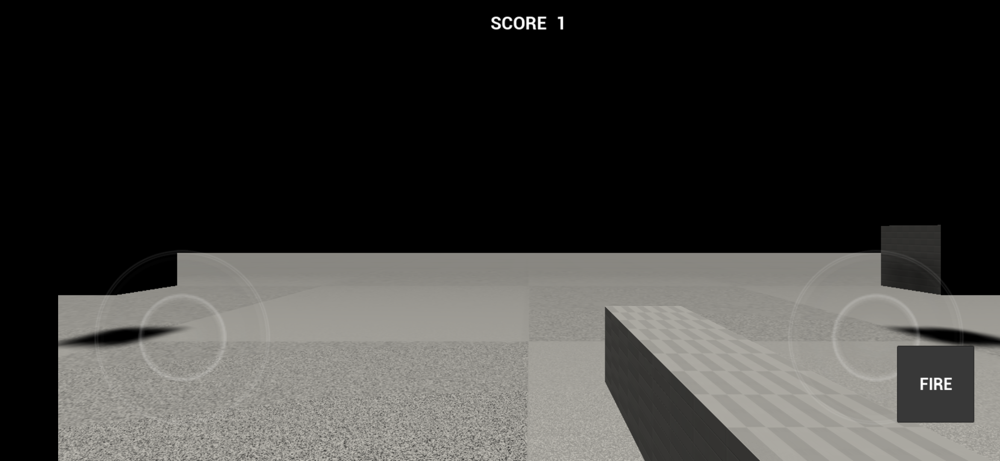

# Shooter 3D

A small **3D first-person shooter** for Android, built with **Unreal Engine 5.7** in pure C++ — no
external art assets (it uses only the engine's built-in primitive meshes).



## Gameplay

- First-person camera with a cube "gun"
- Mobile virtual joysticks: left stick moves, right stick aims; plus an on-screen **FIRE** button
- 8 red target cubes arranged in a ring — shoot one to score a point; it respawns at a random spot
- Live **SCORE** readout
- Desktop test controls: `WASD` move, mouse look, left-click fire, space to jump

The arena (floor, lighting, sky, targets) is built entirely at runtime in
`AShooterGameMode::BuildArena()` — there is no hand-authored level content beyond an empty map
with a `PlayerStart`.

## Source layout

| File | Role |
|------|------|
| `Source/Shooter3D/ShooterGameMode.*` | Spawns the arena + lights + targets, tracks score |
| `Source/Shooter3D/ShooterCharacter.*` | First-person pawn, movement, firing |
| `Source/Shooter3D/ShooterProjectile.*` | Sphere projectile w/ projectile-movement, hit handling |
| `Source/Shooter3D/ShooterTarget.*` | Shootable target: scores + relocates |
| `Source/Shooter3D/ShooterHUD.*` | Slate overlay: score text + FIRE button |
| `Config/Default*.ini` | Android packaging, renderer, and input mappings |

## Building the Android APK

Requires UE 5.7 with the Android target platform installed, plus the Android NDK/SDK and a JDK.
Set `ANDROID_HOME`, `ANDROID_NDK_ROOT`, `NDK_ROOT`, `NDKROOT`, and `JAVA_HOME`, then:

```sh
UE="/path/to/UE_5.7"
PROJ="$PWD/Shooter3D.uproject"

# 1. Compile the editor module
"$UE/Engine/Build/BatchFiles/Mac/Build.sh" Shooter3DEditor Mac Development -project="$PROJ" -waitmutex

# 2. Cook + package a self-contained APK (data packed inside the APK)
"$UE/Engine/Build/BatchFiles/RunUAT.command" BuildCookRun -project="$PROJ" \
  -platform=Android -cookflavor=ASTC -clientconfig=Development \
  -build -cook -stage -package -pak -archive -archivedirectory="$PWD/Archive" \
  -nodebuginfo -nocompileeditor -utf8output
```

The result is `Archive/Android_ASTC/Shooter3D-arm64.apk` (~125 MB, debug-signed, arm64-v8a,
minSDK 26 / targetSDK 34). `bPackageDataInsideApk=True` keeps everything in one file so a plain
`adb install` works with no separate `.obb`.
